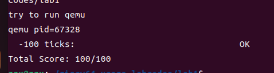

<h1><center>lab1实验报告</center></h1>

## 练习一

1. `la sp,bootstacktop`：将`bootstacktop`对应的地址赋值给`sp`寄存器，目的是初始化栈，为栈分配内存空间。
2. `tail kern_init`：尾调用，在函数`kern_init`的位置继续执行，目的是进入操作系统的入口，也避免了这一次的函数调用影响`sp`。

## 练习二

实现代码如下：

```c
clock_set_next_event();
ticks++;
if(ticks == 100)
{
    print_ticks();
    ticks = 0;
    num++;
}
if(num == 10)
{
    sbi_shutdown();
}
```

+ 实现过程：首先调用`clock_set_next_event`函数，设置下次的中断时间，为当前时间加上100000。接着`ticks`自增1，如果`ticks`为100，调用`print_ticks`打印`ticks`，将`ticks`置0，`num`自增1。如果`num`增加到10，调用`sbi_shutdown`关机。
+ 定时器中断处理流程：
  + 当发生时钟中断时，会跳转到寄存器`stvec`保存的地址执行指令，即`__alltraps`的位置继续执行。
  + 接着保存所有的寄存器，然后执行`mov a0,sp`将`sp`保存到`a0`中，之后跳转到`trap`函数继续执行。
  + 调用`trap_dispatch`函数，判断异常是中断，跳转到处理函数`interrupt_handler`处继续执行。
  + 根据`cause`的值，跳转到`IRQ_S_TIMER`处继续执行。

## 扩展练习一

1. 异常处理的步骤如下：
   + 异常产生后，会跳转到寄存器`stvec`保存的地址执行指令，由于内核初始化时将该寄存器设置为`__alltraps`，所以会跳转到`trapentry.S`中的`__alltraps`标签处执行。
   + 接着保存所有的寄存器，然后执行`mov a0,sp`将`sp`保存到`a0`中，之后跳转到`trap`函数继续执行。
   + 调用`trap_dispatch`函数，判断异常是中断还是异常，分别跳转到对应的处理函数`interrupt_handler`或`expection_handler`处根据`cause`的值执行相应的处理程序。
2. 执行`mov a0,sp`的原因是，根据RISC-V的函数调用规范，`a0~a7`寄存器用于存储函数参数。而`trap`函数只有一个参数，是指向一个结构体的指针，所以需要将该结构体的首地址保存在寄存器`a0`中。
3. 寄存器保存的位置是由结构体`trapframe`和`pushregs`中的定义顺序决定的，因为后续这些寄存器都要作为函数`trap`的参数的具体内容。
4. 需要保存所有的寄存器。因为这些寄存器都将用于函数`trap`参数的一部分，如果不保存所有寄存器，函数参数不完整。如果修改`trap`的参数的结构体的定义，可以不需要存所有的寄存器，比如0寄存器，因为它永远是0。

## 扩展练习二

1. + `csrw sscratch, sp`：将`sp`的值赋值给`sscratch`
   + `csrrw s0, sscratch, x0`：将`sscratch`赋值给`s0`，将`sscratch`置0

   目的是使用`s0`来表示函数调用前栈顶的位置。将`sscratch`置0，这样如果产生了递归异常，异常向量就会知道它来自于内核

2. 不还原那些 `csr`，是因为异常已经由`trap`处理过了，没有必要再去还原。它们包含有关导致异常或中断的信息，这些信息在处理异常或中断时可能仍然需要。在异常或中断处理程序中，这些`csr`可能需要被读取以确定异常的原因或其他相关信息。这样的意义是将这些状态寄存器作为参数的一部分传递给`trap`函数，确保在处理异常或中断时能够保留关键的执行上下文，以供进一步处理或记录异常信息。这种方式允许更灵活地处理异常和中断情况。

## 扩展练习三

编程实现如下：

```c
case CAUSE_ILLEGAL_INSTRUCTION:
     // 非法指令异常处理
     /* LAB1 CHALLENGE3   YOUR CODE :  */
    /*(1)输出指令异常类型（ Illegal instruction）
     *(2)输出异常指令地址
     *(3)更新 tf->epc寄存器
    */
    cprintf("Exception type:Illegal instruction\n");
    cprintf("Illegal instruction caught at 0x%08x\n", tf->epc);
    tf->epc += 4; 
    break;
case CAUSE_BREAKPOINT:
    //断点异常处理
    /* LAB1 CHALLLENGE3   YOUR CODE :  */
    /*(1)输出指令异常类型（ breakpoint）
     *(2)输出异常指令地址
     *(3)更新 tf->epc寄存器
    */
    cprintf("Exception type: breakpoint\n");
    cprintf("ebreak caught at 0x%08x\n", tf->epc);
    tf->epc += 2; //这里由于ebreak占2个字节，所以下一条指令偏移为2
    break;
```

在`kern_init`函数中，`intr_enable();`之后写入两行

```c
asm("mret");
asm("ebreak");
```

运行之后的输出如下：

```shell
sbi_emulate_csr_read: hartid0: invalid csr_num=0x302
Exception type:Illegal instruction
Illegal instruction caught at 0x80200050
Exception type: breakpoint
ebreak caught at 0x80200054
```

异常必须在`idt_init();`调用之后才会正确执行，因为在该函数中设置`stvec`的值，在这之前不会跳转到我们定义的异常处理程序。

## 重要的知识点

1. 断
   * 异常：指令执行发生异常
   * 陷入：主动让指令停止
   * 外部中断：CPU执行进程时被外设传来的信号打断

2. 进程的保护与恢复
   * 实验中的进程恢复时，并未将所有寄存器的值予以恢复。正如拓展练习二中所提及的，这些寄存器的值将用来准确刻画发生的异常或中断并采取合适的方法处理它们。
   * OS原理中，并未提及该情况。
3. 实验中未提及进程控制块PCB等知识点

## 检测

运行`make grade`之后输出如下


